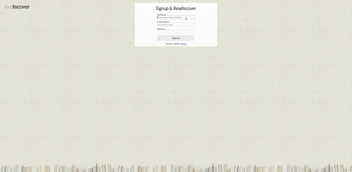
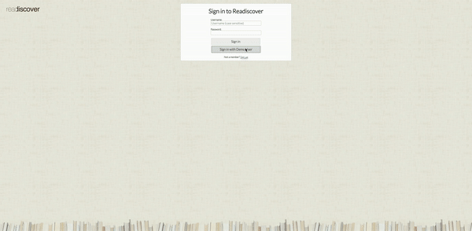
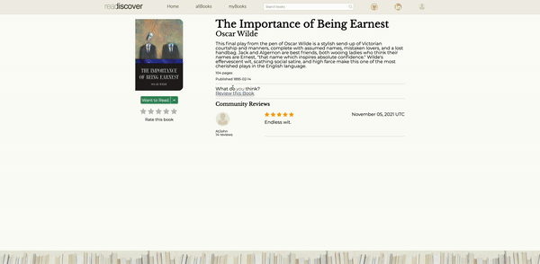
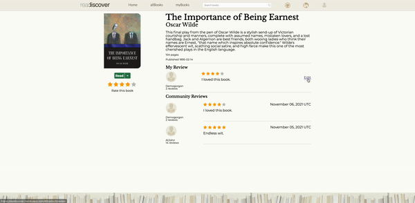
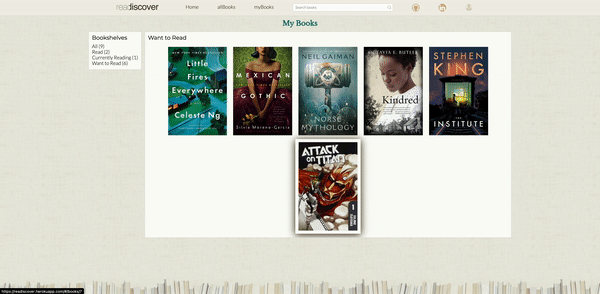

# Readiscover Readme

You can find Readiscover live [here](https://readiscover.herokuapp.com/)!

## Background

Rediscover the joy of reading. `Readiscover` is a Goodreads clone, a social media platform where users can log books they have read or want to read. Users can also review books, and find information on books they are interested in. Users may add books to their bookshelves by tagging the as 'read', 'currently reading' and 'want to read'.

## Technologies

* Ruby on Rails
* React/Redux
* PostgreSQL
* JavaScript
* AJAX / JBuilder
* HTML5 / SCSS

## Features

* ### User auth 
    * Users may register an account and login.  
      
    * Users may also login using a demo user account.  
      

* ### Books
    * Users may browse a selection of books and see their information.  
      

* ### Reviews
    * Users may view reviews left on books by other users, or rate and leave a review of their own.
    
    * Users may also update or delete their ratings and reviews.
    

* ### Bookshelves
    * Users may add to their bookshelves by marking them as 'Read', 'Want to Read', or 'Currently Reading'.
    
    * Users may also remove a book from their shelves.
    

* ### Search
    * Users may search for a book by title or author name.
    
    ```const searchString = this.state.searchString;
        if (searchString.length >= 1) {
            filteredBooks = this.props.books.filter(book => {
                return book.title.toLowerCase().includes(searchString.toLowerCase()) ||
                    book.author.toLowerCase().includes(searchString.toLowerCase());})
                }
    ```
    The user's input will update the state of the navbar component, and the searchString in the state allows the user to filter books by book title or author name, utilizing toLowerCase() to avoid case-sensitivity.

* ### Mobile and Tablet Friendly
    * Readiscover is dynamically-scaling and built for devices of all sizes.
    

## Upcoming Features

* Review Statistics
* Review Comments
* Review Likes
* Splash Page